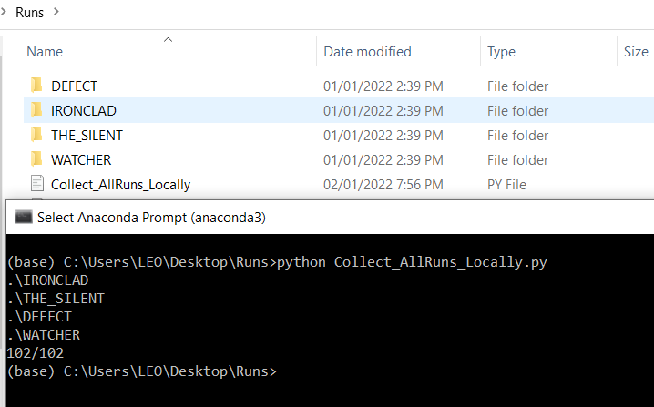

# Slay the Spire Run Compiler

This project intends to help players to easily compile their runs into csv and json format. It will help players to have the opportunity to analyze their runs and discover more insights from the game.

To run the script, copy the folder of runs in a separate folder. In your directory, it should have 'IRONCLAD', 'THE_SILENT', 'DEFECT', and 'WATCHER' folders.
Then run the script like this in the figure to have compiled runs in CSV and JSON format.

 